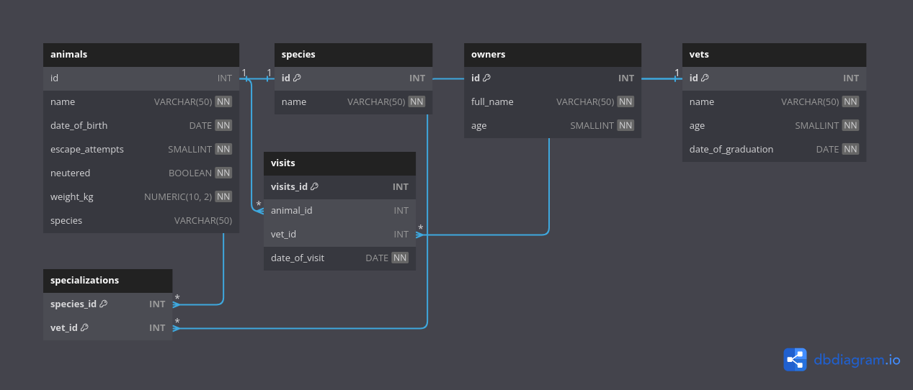

# Clinic & Veterinary Database

## Overview
This project contains a relational database schema for managing clinic and veterinary records. It includes ER diagrams, SQL schema, sample data, and queries.

## Files
- **[`clinic_diagram.png`](clinic_diagram.png)** - Clinic ERD.
- **[`vet-clinic-schema-diagram-erd.png`](vet-clinic-schema-diagram-erd.png)** - Vet clinic ERD.
- **[`schema.sql`](schema.sql)** - Database schema setup.
- **[`schema_based_on_diagram.sql`](schema_based_on_diagram.sql)** - Alternative schema.
- **[`data.sql`](data.sql)** - Sample data.
- **[`queries.sql`](queries.sql)** - Example queries.

## ER Diagrams
### Clinic Database

### Veterinary Clinic Database

## Setup
1. Install MySQL/PostgreSQL.
2. Run `schema.sql` to create tables.
3. Populate data with `data.sql`.
4. Test queries using `queries.sql`.

## Schema
### Clinic
- **Patients**, **Medical Histories**, **Treatments**, **Invoices**, **Invoice Items**.

### Veterinary Clinic
- **Animals**, **Species**, **Owners**, **Vets**, **Visits**, **Specializations**.
